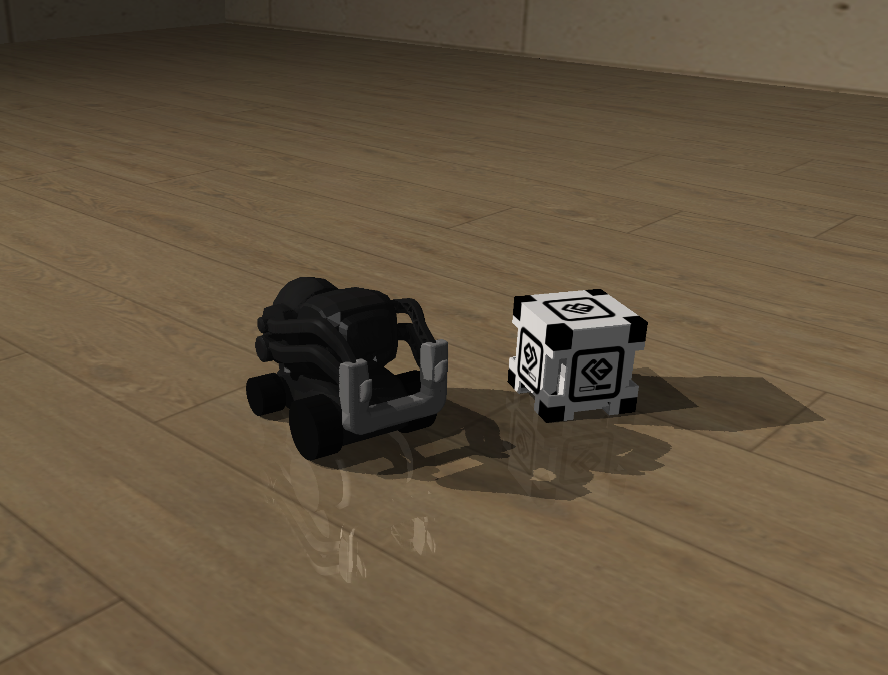

# cozmo-rl

Sim-to-real reinforcement learning, demonstrated on the Anki Cozmo robot. Policies are trained in a MuJoCo
simulation and run directly on hardware via [`pycozmo`](https://pycozmo.readthedocs.io/en/stable/).

**Click to watch demo:**
[](https://youtu.be/F_28-Gwk0q0)

This repository is an entry point for self-learners, researchers, and robotics enthusiasts who want hands-on experience with sim-to-real training with affordable, real hardware. For those who don't own a Cozmo, the simulation scripts alone are enough to train and test policies virtually.

## Contents
- [Setup](#setup)
- [Configuration](#configuration)
- [Gym Environment](#gym-environment)
  - [Action Space](#action-space)
  - [Observation Space](#observation-space)
- [Training Pipeline](#training-pipeline)
  - [1. Record expert demos](#1-record-expert-demos)
  - [2. Train using Behavioral cloning (BC)](#2-train-using-behavioral-cloning-bc)
  - [3. Train using Proximal Policy Optimization (PPO)](#3-train-using-proximal-policy-optimization-ppo)
- [Running a Trained Policy](#running-a-trained-policy)
  - [Run in simulation](#run-in-simulation)
  - [Run on real hardware](#run-on-real-hardware)
- [Debugging Scripts](#debugging-scripts)
  - [hardware/test](#hardwaretest)
  - [sim](#sim)
- [Adding a New Task](#adding-a-new-task)
- [Acknowledgements](#acknowledgements)

## Setup
1. Install a Python 3.12 virtual environment (PyCozmo raises errors on newer Python versions)
```bash
py -3.12 -m venv .venv
```
2. Activate the virtual environment
```
source .venv/Scripts/activate
```
3. Install dependencies
```bash
pip install -r requirements.txt
```

Hardware scripts require a Cozmo connected to its Wi-Fi network for [`pycozmo`](https://github.com/gasgiant/PyCozmo) to able to reach it.

## Configuration

Task, policy choice, and hyperparameters live in `config.py`:

```python
from train.tasks import *

TASK = RollCube()
INIT_POLICY = "./models/bc/roll_cube"
POLICY_TYPE = "ppo"
...
```

- **TASK**: Selects the task, which is used when training or running policies.

- **INIT_POLICY**: Sets the path of the policy you would like to warm-start PPO training from, or `None` if you would like to train PPO from scratch.

- **POLICY_TYPE**: Sets the type of policy you would like to run for the task, which is `"bc"` or `"ppo"`.

## Gym Environment
A custom gym environment was built for Cozmo, which respects the real hardware actions and observations available so that transfer learning is possible.

**Note:**
- Some conversions are required from sim to real to map MuJoCo joints to the PyCozmo API.
- Actions are normalized to [-1, 1] for training policies, and denormalized to their action ranges after inference.
- Currently, observations for only cube 1 is supported, not all three
### Action Space
---
- Left wheel velocity
  - Real: [-200, 200] mm/s
  - Sim: [-15.22, 15.22] rad/s

- Right wheel velocity
  - Real: [-200, 200] mm/s
  - Sim: [-15.22, 15.22] rad/s

- Lift angle [-0.2, 0.79] rad

- Head angle [-0.44, 0.78] rad

### Observation Space
---

#### Translational Position (mm)
- pose_x
- pose_y
#### Angular Position (rad)
- sin(pose_angle)
- cos(pose_angle)
#### Translational Velocity (mm/s)
- lwheel
- rwheel
#### Lift Position (rad)
- lift
#### Head Angle (rad)
- head
#### Cube Acceleration (mm/s^2)
- accel_x
- accel_y
- accel_z
#### Vision (pixels)
- Downsampled to 80 x 60 x 1
  - Stack of 3 images for temporal info


## Training Pipeline
1. Record expert demos for the task, controlling the robot in sim using `teleop_sim.py`.

2. Train from these demos via Behavioral Cloning (BC).
3. Train the final policy using Proximal Policy Optimization (PPO), warm-starting from the BC policy.

**Note:** It is not required to warm-start from BC; PPO can be used directly, but for complex tasks it is suggested to start with BC for easier training.

### 1. Record expert demos

```bash
python -m sim.teleop_sim
```

Drive the robot and save teleoperated demonstrations of the task using the following  controls:

```
W / S         Drive forward / back
A / D         Turn left / right
Shift         Precision mode
Up / Down     Move head
Left / Right  Move lift
[ / ]         Cycle camera (chase / cozmo_cam / tracking)
Space         Start demo / save demo
Backspace     Discard demo
R             Reset
Q             Quit
```

Demos save to `demos/<task_name>/*.npz`.

### 2. Train using Behavioral cloning (BC)

```bash
python -m train.train_bc
```

Trains a policy via [`imitation.BC`](https://imitation.readthedocs.io/en/latest/) using the expert demos for the configured task, saved to `models/bc/<task_name>.zip` as a PPO policy for warm-starting training.

Tune learning rate, epochs, and batch size in `config.py`.

### 3. Train using Proximal Policy Optimization (PPO)

```bash
python -m train.train_ppo
```

Trains a policy via [`SB3 PPO`](https://stable-baselines3.readthedocs.io/en/master/modules/ppo.html). If `INIT_POLICY` is set, the policy is warm-started from it before training.

- Checkpoints save every 15k steps by default to `models/checkpoints/`.
  - `train_ppo` resumes from the latest checkpoint automatically.

- Final policy saves to `models/ppo/<task_name>.zip`.

- Logs include `rollout/success_rate` (calculated from each task's `do_terminate`) alongside the usual SB3 metrics.

- Every `VIDEO_EVERY` episodes, an environment is recorded to `models/videos/<task_name>/`.

Hyperparameters for PPO can be tuned in `config.py`. Target KL is optional and can be set to `None`, but is recommended to avoid overly destructive gradient updates.

## Running a Trained Policy
### Run in simulation

```bash
python -m sim.run_policy
```

Loads `models/<POLICY_TYPE>/<task_name>.zip` and runs 5 episodes in the MuJoCo viewer.

### Run on real hardware

```bash
python -m hardware.run_policy
```

Connects to Cozmo via its Wi-Fi and streams robot, cube, and camera data to create observation vector via `CozmoObserver`. After pressing Enter, the policy in `models/<POLICY_TYPE>/<task_name>.zip` runs and writes the action vector to the Cozmo hardware live. Ctrl+C stops motors and disconnects cleanly.

## Debugging Scripts
### hardware/test

- `get_obs.py`
  - Print the live observation vector.
- `view_cam.py`
  - Show the downsampled frame stack the policy sees.
- `calibrate_vision.py`
  - Side-by-side of real camera feed with sim camera feed for tuning vision noise in `DomainRandomizer`.
- `calibrate_state.py`
  - Drive a scripted action sequence on real hardware, replay the same actions in sim, and report drift for each state value. This helps tune MuJoCo constants to match reality.

### sim
- `view_sim.py`
  - Show domain randomized simulation environment in default MuJoCo viewer.

## Adding a New Task

A new task is created by defining a new Python file in `train/tasks`. `Task` is an abstract interface that should be implemented when defining new tasks.

- The following methods must be implemented:
```python
@abstractmethod
def reset(self, sim: CozmoSim) -> None:
    """Defines logic to reset task state for new episode."""

@abstractmethod
def reward(self, sim: CozmoSim, action: np.ndarray) -> float:
    """Defines reward function for the task."""

@abstractmethod
def do_terminate(self, sim: CozmoSim) -> bool:
    """Defines condition to terminate the episode (success or failure)."""
```
- The following method should be overriden if the task should pin an action value that does not need training to execute the task:
```python
def get_fixed_actions(self) -> dict[int, float]:
    """Defines actions to keep constant for the task. \n
    {action_id: action_value}"""
    return {}
```


- Ensure that your new task is imported in `train/tasks/__init__.py` so it can be accessed in `config.py`

**Note:**
- CozmoSim provides `get_raw_state()`, which offers privileged info about the cube state and step count, not available in reality. These can be used for defining reward conditions and the termination condition, but note that they are not sent to the policy during training.

  - E.g. TouchCube uses distance from the cube as a reward metric, but the policy must learn a correlation from just its sensors and vision.

See existing tasks for examples.

## Acknowledgements
- Floor/wall textures are from [Poly Haven](https://polyhaven.com/).

- Meshes come from a mix of [nilseuropa/anki_description](https://github.com/nilseuropa/anki_description)
  and [RazuProject/og-cozmo-model](https://codeberg.org/RazuProject/og-cozmo-model).
  The Cozmo fork mesh from `RazuProject` was convex-hulled and edited in Blender for accurate fork collisions.

- The URDFs in [nilseuropa/anki_description](https://github.com/nilseuropa/anki_description) were converted and used as a reference for building the MuJoCo XMLs in `sim/models/`.